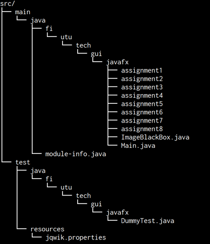
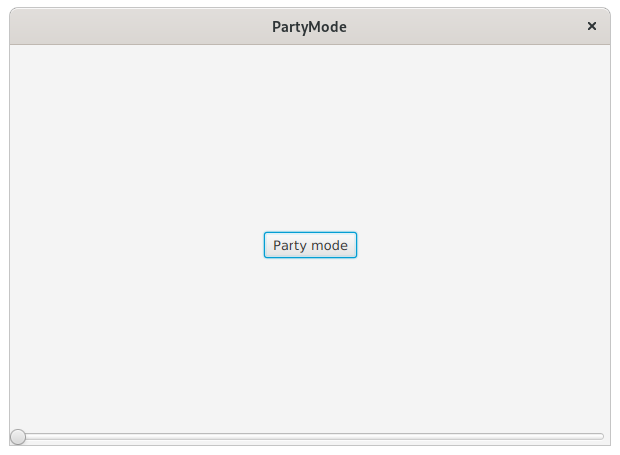
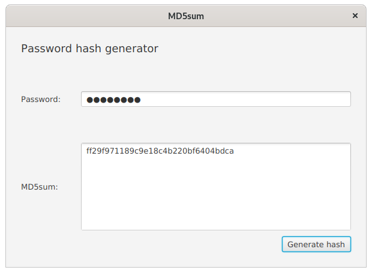
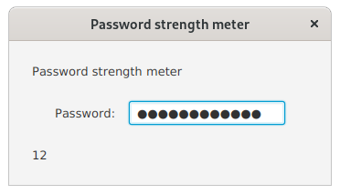
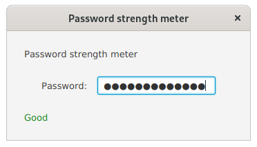
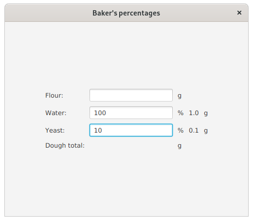
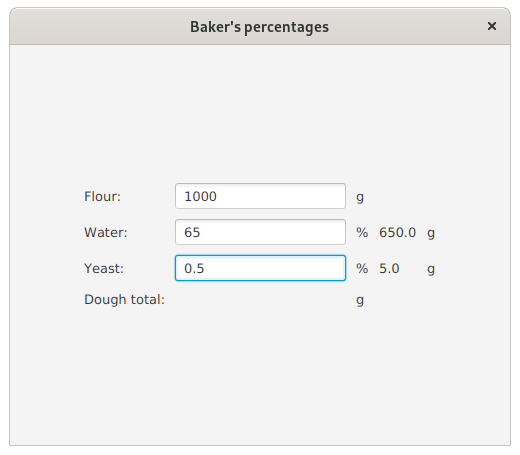
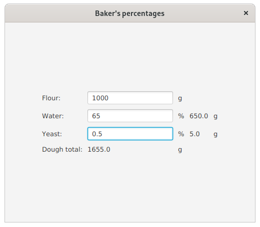

# Assignment A3

This week we will be concentrating on adding functionality to GUIs created with declarative FXML using controller classes, reactive bindings, conditional properties and converting between different property types.


## General instructions
The sub-assignments should be done in their respective folders (in the src/main source tree): the first assignment of A2 should be done in folder "assignment1", the second assignment of A2 in "assignment2" and so on (figure). **As previously**, some of the files need to be located under `src/main/resources`. This is mostly to do with FXML files.



A specific assignment to be started can be executed by giving the assignment number as a command line argument.

Using maven to compile and run:

```
mvn compile exec:java -Dexec.args="assignmentnumber"
```

E.g. for compiling and executing assignment 3:

```
mvn compile exec:java -Dexec.args="3"
```

Your IDE of choice (Eclipse, VSCode, IntelliJ) has their own way of specifying command line arguments. Refer to their documentation in case you're not familiar with them.

## Assignment 1 - Party Controller (0.5p)
In this assignment, your task is to modify the given `PartyMode` FXML using SceneBuilder to work with the given controller class `PartyController`. You should modify the FXML file so that a correct controller class is being used and the included references and event handlers will work without modifications to the `PartyController` class.

You should not make any changes to the layout of UI.




## Assignment 2 - MD5 sum calculator (0.5p)
In assignment 1 we modified FXML to work with given controller class. In this exercise, we will do the opposite: create a controller that is compatible with the given FXML.

Background information: Hash algorithms make it possible to create "one way" conversion of given data. In practise this means that the text "Hello world!" can be easily *hashed* into `86fb269d190d2c85f6e0468ceca42a20` using MD5 algorithm. Converting the hashed value back into the original is a lot more resource intensive task. Hash values can be used to check the file integrity or saving passwords.

The assignment template includes an easy-to-use method to use MD5 algorithm on String:

```java
MD5Sum.calculateMD5Sum("Text-to-be-hashed");
```

which will return a hexadecimal string representation of the MD5 hashed value of the UTF-8 encoded input text.

The FXML file contains all the required names for component objects and event handlers. Your task is to create a controller class (`GeneratorController.java`) that works as follows:

When user presses the "Generate Hash" button, the password in password field will be hashed using the provided method and the result will be displayed on the large text area. If an exception happens, create an alert window with "Error" as its type and show the exception message on that window.

*Disclaimer: MD5 algorithm is not recommended any more for storing passwords; also there is a lot more to saving passwords than the algorithm, like salting the values, making sure that the hashes do not leak in the first place etc. Do not use this as a basis for creating your own authentication system.*




## Assignment 3 - Password reveal (0.5p)
In assignment 4 we'll familiarize ourselves with property bindings by starting from the basics. The template includes a UI created with plain old Java with a password field and a label for your use. The label should be updated using property bindings (**not** traditional event handlers!) as follows:

The component `resultLabel` should show the password in password field as it is being written


## Assignment 4 - Password length (0.5p)
The assignment 4 closely follows assignment 3 but instead of revealing the password, it should show the length of the password in `resultLabel` as it is being written. Again, using property bindings.




## Assignment 5 - The password quality (0.5p)
In this assignment we do not show the legnth of the password. Instead we use the it to measure the password quality. Use conditional bindings to implement the following:

The component `resultLabel` should say "Good", whenever the password is over 12 characters long. Otherwise it should say "Poor". In addition to the text property changing, the label color should be *green* when the password is good and *red* when poor. Bindings should be used for the colors as well.



## Assignment 6 - Baker's percentages (0.5p)
In baking, it is common to use so called "Baker's percentages" where the amount of flour is given as an absolute unit (grams) and the rest of the incredients relative to the amount of flour. E.g. 1000g of flour with 65% hydration (water) will result in 1000g of flour and 650g of water

The development of the application is divided into three incremental parts (up until assignment 8). The first goal is to use **property bindings** on the amount of water and yeast. For starters, it is enough that the amount fields of the these two will contain only the given percentage value divided by 100. E.g. if the water percentage is 10%, the amount should show 0.1g. The amount of flour is not used yet nor should the total amount of dough be calculated.




## Assignment 7 - Baker's percentages - flours included (0.5p)
Let's continue on the baker's percentages using property bindings. Next up we should take into account the amount of flour as well. Ie. the amount of yeast and water should be calculated by `(incredientPercentage/100)*amountOfFlour`.

As an end result we should have a working application still without the total dough weight calculation. Remember that the amounts should update whenever any of the relevant inputs change. Proper use of bindings should take care of this!




## Assignment 8 - Calucating the total amount of dough (0.5p)
Let's put the final polish on our application by calculating the total amount of dough as grams into `doughTotalAmountLabel`. Again, using reactive bindings.


