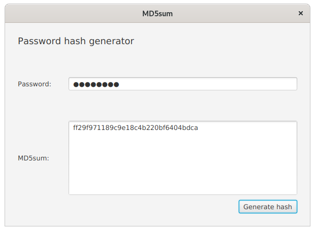
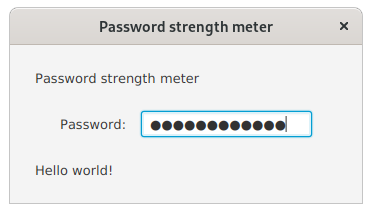
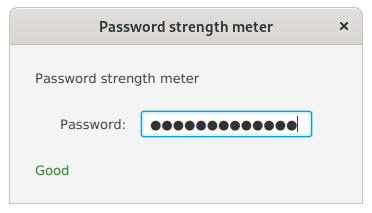
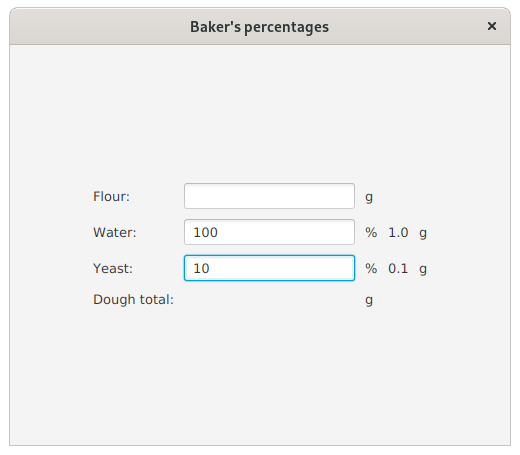
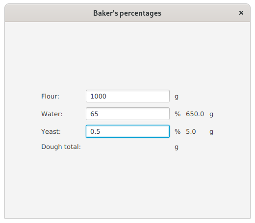

# Tehtävänanto A3

Tämän viikon aiheena ovat toimintojen liittäminen FXML-käyttöliittymäkuvaukseen (kontrolleriluokat) sekä reaktiiviset sidokset, ehdollisuus liitoksissa sekä tyyppimuunnokset.

## Yleiset ohjeet
Viikkotehtävien alakohdat tulisi tehdä niille varattuihin kansioihin (hakemistopuussa `src/main`): eli siis tämän viikon (A3) ensimmäinen harjoitus tulisi tehdä kansioon "assignment1" ja toinen harjoitus kansioon "assignment2" jne. (ks. kuva). **Kuten aikaisempina viikkoina**, osa tehtävien tiedostoista tulee asettaa `src/main/resources`-hakemistopuun alle. Tämä koskee lähinnä FXML-tiedostoja.


Halutun harjoitustyön pystyy käynnistämään antamalla ohjelmaa käynnistäessä komentoriviparametrina ("command line argument/parameters") tehtävänumeron. 

Maven-koontityökalua käyttäen kääntö ja ohjelman suoritus:

```
mvn compile exec:java -Dexec.args="tehtävänumero"
```

Esim. jos halutaan ajaa tehtävä 3:

```
mvn compile exec:java -Dexec.args="3"
```

Kun käytät jotakin kehitysympäristöä, kuten Eclipseä, VSCodea tai IntelliJ:tä, on niissä jokaisessa omat tapansa antaa suoritettavalle ohjelmalle komentoriviparametrinsa. Nämä tavat selviävät tarkastelemalla kehitysympäristön dokumentaatiota, mikäli asia ei ole ennalta tuttu.

## Tehtävä 1 - Bilekontrolleri (0,5p)
Tässä tehtävässä tarkoituksena on käyttöliittymäkuvauksen liittäminen olemassa olevaan kontrolleriin. Käyttöliittymäkontrolleri on määritelty luokassa `PartyController` ja käyttöliittymä vastaavasti resurssihakemiston FXML-tiedostossa `PartyMode`. Tehtävänäsi on muokata FXML-tiedostoa SceneBuilderissa siten, että valmiiksi annettua kontrolleria käytetään ja se myös toimii virheettä. Kontrollerissa oletetaan, että FXML-kuvauksessa komponenteille on määritetty tietyt nimet sekä tapahtumankäsittelijät.

Älä tee muutoksia kontrolleriluokkaan, vaan muokkaa FXML-tiedosto SceneBuilderilla toimimaan kontrollerin kanssa. Käyttöliittymän graafiseen ilmeeseen ei tule myöskään tehdä muutoksia. 


## Tehtävä 2 - MD5-summalaskin (0,5p)
Tehtävässä 1 muokattiin FXML-tiedosto toimimaan kontrollerin kanssa. Tässä tehtävässä tehdään toisin päin. Tarkoituksena on tehdä FXML-määrittelyyn sopiva kontrolleri.

Taustaa: Tiivistealgoritmeilla on mahdollista luoda datasta yksisuuntainen tiivistearvo. Käytännössä tämä tarkoittaa, että teksti "Hello world!" muuttuu MD5-algoritmilla nopeasti muotoon `86fb269d190d2c85f6e0468ceca42a20`. Tästä tiivistemuodosta on kuitenkin hankala päätellä alkuperäistä arvoa nopeasti. Tiivistearvoja voidaan käyttää esimerkiksi tiedoston eheyden tarkistamiseen tai salasanojen tallettamiseen.

Tehtävässä annetaan mukana MD5-summia heksadesimaalistringeinä palauttava algoritmi, jonka käyttö on helppoa:

```java
MD5Sum.calculateMD5Sum("Hashattava teksti");
```

palauttaa String-tyyppisen olion, jossa on em. tekstin UTF-8-enkoodauksesta tehty tiivistearvo heksadesimaaleina.

Käyttöliittymässä on määritelty tarvittaville käyttöliittymäkomponenteille nimet sekä tarvittavat tapahtumankäsittelijät. Tehtäväsi on luoda tälle käyttöliittymälle kontrolleri (`GeneratorController.java`), jonka toiminnallisuus on seuraava:

Nappia painettaessa salasanakentän tekstistä luodaan MD5-tiivistearvo, jonka tulos laitetaan alempaan tekstilaatikkoon. Mikäli tapahtuu poikkeus, luo Error-tyyppinen Alert-ikkuna, jossa on poikkeuksen viesti.

*Huom! MD5-algoritmia ei enää suositella salasanojen säilyttämiseen; muutoinkin salasanojen tallettamiseen liittyy useita eri seikkoja, kuten suolaaminen ja tiivistearvojen leviämisen esto. Älä siis käytä tätä tehtävää pohjana oman autentikointijärjestelmän luonnissa.*




## Tehtävä 3 - Salasanan paljastus (0,5p)
Tehtävässä 4 aloitetaan rektiivisiin sidoksiin tutustuminen. Tehtävässä on annettu valmiina Javalla ohjelmoitu käyttöliittymä, jossa on salasanakenttä sekä Label-komponentti, joihin olisi tarkoitus reaktiivisien sidosten (**ÄLÄ** siis käytä perinteisiä tapahtumankäsittelijöitä) avulla toteuttaa seuraava toiminnallisuus:

Komponentissa `resultLabel` tulisi näkyä salasanakenttään kirjoitettava salasana sitä mukaa kun salasanaa kirjoitetaan. 




## Tehtävä 4 - Salasanan pituus (0,5p)
Tämä tehtävä on melko samankaltainen tehtävän 3 kanssa, mutta sen sijaan, että salasana paljastetaan, tulisikin komponentissa `resultLabel` näkyä kirjoitettavan salasanan pituus sitä mukaa kun salasanaa kirjoitetaan. Jälleen reaktiivisia sidoksia käyttäen.


## Tehtävä 5 - Salasanan vahvuus (0,5p)
Tässä tehtävässä ei näytetä salasanan pituutta, mutta sitä kuitenkin käytetään hyväksi salasanan laadun mittaamiseen. Toteuta reaktiivisia sidoksia käyttäen seuraava toiminnallisuus:

Komponentissa `resultLabel` tulee lukea "Good", mikäli salasana on yli 12 merkkiä pitkä ja "Poor" muussa tapauksessa. Tämän lisäksi `resultLabel`-komponentin tulee olla hyvän salasanan tapauksessa vihreä ja huonon salasanan tapauksessa punainen. Myös tähän tulee käyttää reaktiivisia sidoksia ja muutosten tulee tapahtua kirjoittaessa.



## Tehtävä 6 - Leipurin prosentit (0,5p)
Leivonnassa saatetaan grammamäärien sijaan käyttää ns. leipurin prosentteja. Tässä mallissa määritetään ensin jauhojen määrä jossakin yksikössä, esim. grammoina ja loppujen ainesosien määrä määritetään suhteessa jauhojen määrään. Esimerkiksi 1000g jauhoja ja 65 % vettä tarkoittaa 650 g vettä.

Ohjelman kehitys on jaettu inkrementaalisiin osiin tehtävään 8 asti. Ensimmäinen tavoite on toteuttaa **reaktiivisilla sidoksilla** toiminto, jossa veden ja hiivan grammamääräksi tulee aina annetun prosenttimäärän sadasosa. Toisin sanoen, mikäli veden prosenttiosuudeksi on määritetty 10 %, näkyy grammakentässä 0.1g. Jauhojen määrää ei tässä kohtaa tehtävää tule ottaa huomioon, eikä taikinan painoa laskea.

Arvojen tulee päivittyä sitä mukaa kun ne muuttuvat kentissä.



*Vinkki: Tehtävässä tulee osata muuntaa syöttökenttien arvoista numerotyyppisiä*


## Tehtävä 7 - Leipurin prosentit jauhoilla (0,5p)
Jatketaan edellistä tehtävää edelleen reaktiivisia sidoksia käyttäen. Tässä kohtaa otetaan laskuihin jauhon määrä. Toisin sanoen veden ja hiivan määrä lasketaankin nyt kaavalla `(prosenttikenttänArvo/100)*jauhojenMrä`.

Lopputuloksena tulisi olla toimiva laskuri ilman taikinan kokonaismassan laskentaa. Määrien tulisi päivittyä aina kun jotakin sen laskentaan relevanttia kenttää muutetaan.




## Tehtävä 8 - Taikinan kokonaismassan laskenta (0,5p)
Viimeistellään ohjelma vielä siten, että taikinan kokonaispaino grammoina päivittyy (jälleen reaktiivisesti) `doughTotalAmountLabel`-komponenttiin.


